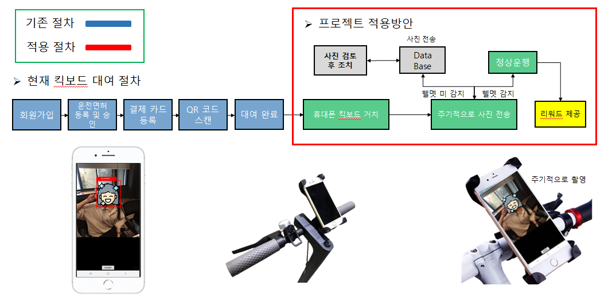
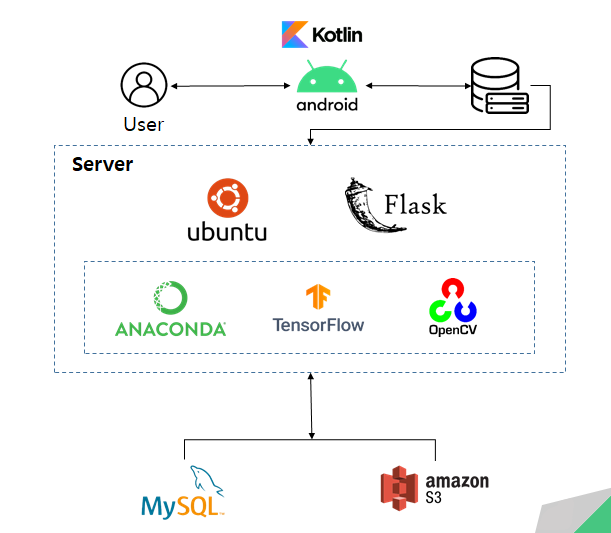

# 안전한 Personal Mobility 문화정착을 위한 AI 서비스

## 1. **배경** 

#### 킥보드 관련 사고건수는 85%나 증가하는 등 점차 심화되고 있고 대부분의 경우 헬멧 미착용 사례로 큰 부상으로 이어지고 있습니다.  이에 따라 우리나라는 지난 5월 헬맷착용 법개정안에 따른 사용자의 헬멧착용 의무화를 추진했지만 이는 실제 효력이 없었습니다. 그래서 저희들은 서울시가 봉착하고있는 문제점의 해결 방안으로 인공지능 헬멧착용 판별 서비스로 사용자에게 리워즈를 제공하고 킥보드 이용자들에게 안전한 라이딩 문화를 만들고자 합니다.

---

## 2.아이디어 프레임워크

---

## 3. 활용기술

---

## 4. 적용 사례

#### 원본이 들어오고 이후 객체탐지 모델로 헬멧 착용 여부를 확인합니다. 만약에 객체 탐지에 실패한 경우 OpenCV 오픈소스를 이용하여 모자이크 처리한 후 저희 데이터베이스(AWS S3, MySQL)에 실패 케이스로 저장이 됩니다. 이후 이 이미지들은 모델의 재학습에 사용 될 것입니다.

---

## 5. 기대효과

